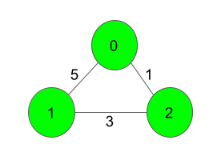
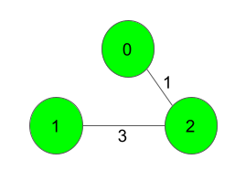

# Prim's Algorithm - Minimum Spanning Tree (MST)

## 💡 Hint
Min-Heap, Visited, Smallest Edge, No Cycles, V - 1 Edges, Priority Queue.

## 📌 Introduction
**Prim’s Algorithm** is a greedy algorithm used to find the **Minimum Spanning Tree (MST)** of a weighted, undirected, and connected graph. It ensures that all vertices are connected with the least possible edge weight while avoiding cycles.

## ✨ Properties of Prim's Algorithm
✔ **Starts with a single vertex** and expands by adding the smallest edge that connects a new vertex.
✔ **Uses a priority queue (min-heap)** to efficiently select the smallest edge.
✔ **Maintains a visited set** to avoid cycles.
✔ **Works well for dense graphs** (when E is close to V²) using an adjacency matrix.
✔ **Ensures MST construction** with `V - 1` edges.

## 🛠 Steps to Implement Prim’s Algorithm
1️⃣ Start from any vertex and initialize a **min-heap** with its edges.
2️⃣ Extract the edge with the **minimum weight** from the heap.
3️⃣ If the edge leads to an **unvisited vertex**, add it to the MST and push all its edges into the heap.
4️⃣ Repeat until **V - 1** edges are added to the MST.

## 🏗 Use Cases
✔ **Network Design:** Used in designing computer networks, telecommunication networks, and road networks.
✔ **Cluster Analysis:** Helps in data clustering techniques.
✔ **Approximation Algorithms:** Used in solving NP-hard problems like the traveling salesman problem.
✔ **Image Segmentation:** Applied in image processing and vision-based applications.
✔ **Electric Grid Systems:** Ensures efficient electricity distribution with minimal wiring cost.

## ⏳ Time Complexity
- **Using Min-Heap & Adjacency List:** `O((V + E) log V)`, but when `E` is near `V²`, it approaches `O(V² log V)`.
- **Using Adjacency Matrix:** `O(V²)`, suitable for dense graphs.

## 🚀 Example of Prim’s Algorithm
### **Input Graph:**

### **MST Edges Selected:**

**Total MST Weight: 4**

## 📌 Code Implementation
🔗 **Check out the implementation here:** [Prim’s Algorithm Code](#)

## 📚 References
🔗 **Video Explanation** by Gate Smashers: [Watch Here](https://www.youtube.com/watch?v=_KX8GDvRzBc)

📝 Feel free to contribute to this repository or suggest improvements! 😊
